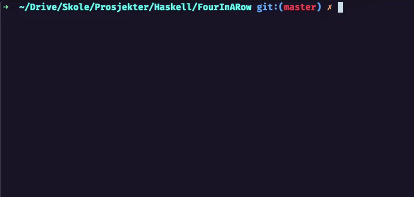

# Four in a row

An two player implementation of the classic [Four in a Row](https://en.wikipedia.org/wiki/Connect_Four) (Connect Four) in Haskell.

## Usage

First, you need to compile `Game.hs` using haskell's compiler, _ghc_. This can be done with the following command, generating a binary `./Game`

- `ghc Game.hs -o ./Game`

When the binary has been made, simply run it with no arguments

- `./Game`

### Playing the game

Both player one and two are controlled by the same controls.

Action | Control
:-     | :-
Left   | _a_ or _j_
Right  | _d_ or _l_
Place  | _s_ or _k_

## Example

## Notes

I use emojis as player tokens, but if this does not work on your machine, simply change the `Show` instance of `Player` in `Game.hs`.
